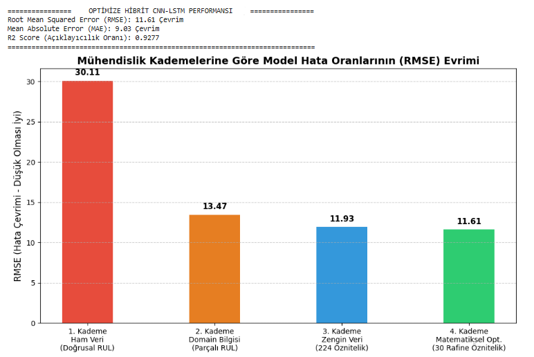
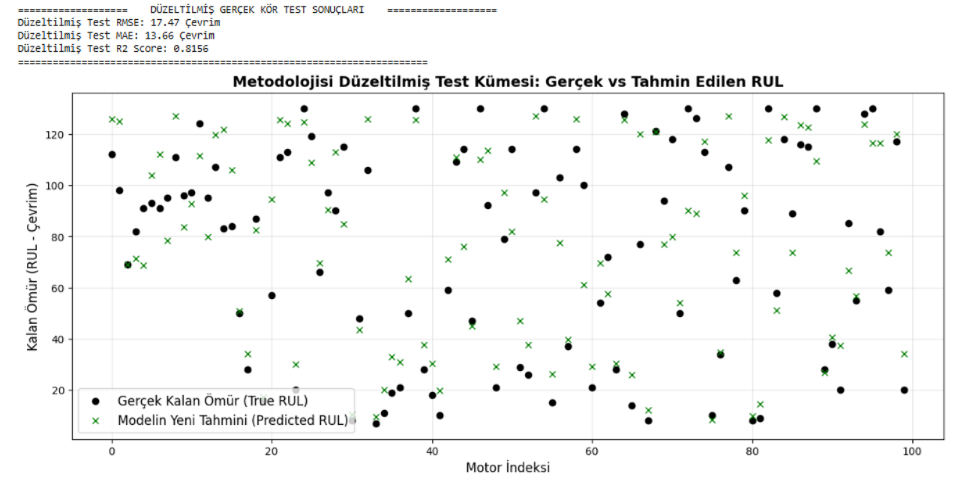

# Predictive Maintenance with CNN-LSTM

Remaining Useful Life (RUL) prediction for turbofan engines using the NASA C-MAPSS dataset, combining time-series feature engineering, feature selection, and a hybrid CNN-LSTM architecture.

## Overview

Predictive maintenance aims to estimate when industrial equipment is likely to fail so that maintenance can be performed before unexpected breakdowns occur.

This project investigates **Remaining Useful Life (RUL) prediction** for turbofan engines using multivariate sensor measurements from the NASA C-MAPSS dataset.

Rather than relying only on raw sensor measurements, the project progressively explores:

- Linear and piecewise RUL target formulations
- Sliding-window sequence modeling
- Multi-scale statistical feature engineering
- CNN-LSTM architectures
- Mutual Information-based feature selection
- Blind-test evaluation on previously unseen engines
- The effect of preprocessing consistency on model generalization

The final corrected pipeline achieved a **test RMSE of 17.47** and **R² of 0.8156** on the FD001 blind test set.

---

## Research Problem

Given a sequence of sensor measurements collected during an engine's operational life, can a deep learning model estimate how many cycles remain before the engine reaches failure?

The task is formulated as a regression problem:

> **Input:** A temporal window of multivariate engine sensor measurements  
> **Output:** Predicted Remaining Useful Life (RUL) in operational cycles

The main objective is not only to improve prediction accuracy, but also to investigate how target formulation, temporal feature engineering, feature selection, and preprocessing affect generalization to unseen engines.

---

## Dataset

This project uses the **FD001 subset of the NASA C-MAPSS Turbofan Engine Degradation Simulation Dataset**.

The training set contains:

- **100 engines**
- **20,631 operational records**
- **21 sensor measurements**
- **3 operational settings**
- Run-to-failure trajectories for each training engine

Each engine begins under normal operating conditions and gradually develops degradation until failure.

The dataset itself is not included in this repository.

Place `CMAPSSData.zip` inside the `data/` directory before running the notebook.

```text
predictive-maintenance-cnn-lstm/
│
├── data/
│   └── CMAPSSData.zip
│
├── notebooks/
│   └── predictive_maintenance_cnn_lstm.ipynb
│
├── figures/
├── README.md
├── requirements.txt
└── .gitignore
```

---

## Methodology

The project was developed incrementally to analyze how different modeling decisions affect RUL prediction.

### 1. RUL Target Construction

The initial experiment used a linear RUL formulation:

```text
RUL = Maximum Engine Cycle - Current Cycle
```

A piecewise RUL formulation was later introduced to limit unrealistically large RUL values during the early healthy stage of engine operation.

The RUL target was capped at:

```text
RUL_MAX = 125 cycles
```

This change substantially improved model performance.

### 2. Sensor Preprocessing

Constant and low-information sensor variables were removed before training.

Sensor measurements were normalized using Min-Max scaling to improve optimization stability and make measurements with different numerical ranges comparable.

### 3. Sliding-Window Sequence Generation

Engine trajectories were converted into fixed-length temporal sequences using a sliding-window approach.

```text
Window length = 30 cycles
```

Each sample therefore represents the recent operational history of an engine rather than a single sensor observation.

### 4. Multi-Scale Feature Engineering

To capture degradation patterns occurring at different temporal scales, additional features were extracted from the sensor signals.

Rolling windows of:

```text
3, 5, 10, and 20 cycles
```

were used to calculate temporal statistics.

Engineered features included:

- Rolling mean
- Rolling standard deviation
- Rolling minimum
- Rolling maximum
- Exponentially Weighted Moving Average (EWMA)
- Cumulative statistics
- Sensor velocity
- Sensor acceleration
- Kurtosis

These features were designed to capture local variation, long-term degradation trends, and changes in sensor dynamics.

### 5. Feature Selection

Advanced feature engineering produced a high-dimensional representation of the sensor signals.

To reduce redundancy and computational complexity, feature selection was performed using:

- Variance filtering
- Correlation analysis
- Mutual Information

The final model used a reduced subset of the most informative features.

---

## CNN-LSTM Architecture

The final model combines **1D Convolutional Neural Networks (CNNs)** with **Long Short-Term Memory (LSTM)** layers.

The two components serve complementary purposes:

**CNN layers** learn local patterns and short-term interactions between engineered sensor signals.

**LSTM layers** model temporal dependencies and long-term degradation behavior across engine cycles.

The general architecture follows:

```text
Sensor Sequence
      ↓
    Conv1D
      ↓
 BatchNorm
      ↓
    Conv1D
      ↓
 MaxPooling
      ↓
     LSTM
      ↓
   Dropout
      ↓
 Dense Layers
      ↓
 Predicted RUL
```

The model was optimized using the Adam optimizer and Mean Squared Error loss.

---

## Experimental Development

Rather than training only a single final model, several stages were evaluated to understand which changes improved RUL prediction.

| Experiment | Validation RMSE |
|---|---:|
| Baseline LSTM + Linear RUL | 30.11 |
| Piecewise RUL | 13.47 |
| Advanced Feature Engineering | ~11.9 |
| Optimized CNN-LSTM | **11.61** |

The largest improvement occurred after replacing the linear RUL formulation with the piecewise target.

Feature engineering and the hybrid CNN-LSTM architecture provided additional improvements.

---

## Blind-Test Evaluation

A separate blind-test evaluation was performed using previously unseen engines from the NASA C-MAPSS test set.

An important generalization issue was discovered during this stage.

### Initial Blind-Test Result

The first blind-test pipeline produced:

| Metric | Result |
|---|---:|
| RMSE | 36.46 |
| MAE | 29.22 |
| R² | 0.1969 |

Despite strong validation performance, the model generalized poorly to the unseen test engines.

### Failure Analysis

The degradation was traced to an inconsistency in preprocessing.

The test data had initially been normalized independently from the training data.

This changed the numerical representation of sensor measurements between training and inference.

The issue illustrates an important machine-learning principle:

> **Preprocessing parameters learned from the training data must be reused during inference.**

### Corrected Blind-Test Pipeline

The preprocessing pipeline was corrected so that the scaler fitted on the training data was also used to transform the test data.

No major model architecture change was required.

After correcting the preprocessing procedure:

| Metric | Initial Test | Corrected Test |
|---|---:|---:|
| RMSE | 36.46 | **17.47** |
| R² | 0.1969 | **0.8156** |

This produced a substantial improvement in generalization to unseen engines.

---

## Key Results

The final experiments demonstrate three main findings:

1. **RUL target formulation strongly affects prediction quality.**  
   Replacing linear RUL with piecewise RUL reduced validation RMSE from 30.11 to 13.47.

2. **Temporal feature engineering improves degradation modeling.**  
   Multi-scale statistical and derivative features further reduced prediction error.

3. **Consistent preprocessing is critical for generalization.**  
   Correcting the train-test scaling mismatch reduced blind-test RMSE from 36.46 to 17.47 and increased R² from 0.1969 to 0.8156.

### Final Performance

**Validation**

- RMSE: **11.61**

**Blind Test**

- RMSE: **17.47**
- R²: **0.8156**

---

## Visual Results

### Model Development

The following comparison illustrates how the prediction error changed throughout the experimental development process.



### Blind-Test Predictions

Predicted Remaining Useful Life values can be compared with the ground-truth RUL values for previously unseen engines.



---

## Technologies

- Python
- TensorFlow / Keras
- NumPy
- Pandas
- Scikit-learn
- SciPy
- Matplotlib
- Jupyter / Google Colab

---

## Repository Structure

```text
predictive-maintenance-cnn-lstm/
│
├── data/
│   └── README.md
│
├── figures/
│   ├── rmse_improvement_stages.png
│   └── corrected_blind_test.png
│
├── notebooks/
│   └── predictive_maintenance_cnn_lstm.ipynb
│
├── .gitignore
├── README.md
└── requirements.txt
```

---

## Running the Project

Clone the repository:

```bash
git clone https://github.com/aysecagla27/predictive-maintenance-cnn-lstm.git
cd predictive-maintenance-cnn-lstm
```

Install the required dependencies:

```bash
pip install -r requirements.txt
```

Place the NASA C-MAPSS archive at:

```text
data/CMAPSSData.zip
```

Then run:

```text
notebooks/predictive_maintenance_cnn_lstm.ipynb
```

The notebook automatically extracts and locates the required FD001 files.

---

## Limitations and Future Work

This project focuses on the FD001 subset, which represents a single operating condition and a single fault mode.

Future work could investigate:

- FD002, FD003, and FD004 under more complex operating conditions
- Cross-condition generalization
- Attention-based temporal models
- Transformer architectures for multivariate sensor sequences
- Automated hyperparameter optimization
- Explainability methods for identifying sensors that contribute most strongly to RUL predictions

---

## Author

**Ayşe Çağla Can**

Computer Engineering  
Research interests: Machine Learning, Deep Learning, NLP, and AI Systems